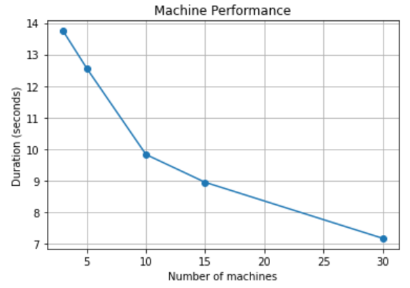

# SLR207 Project

*Author: Benjamin Ternot*

This report consists on the presentation of the implementation of a Map-Reduce distributed Implementation in Java. The whole project was followed step by step from [M. Sharrock page](https://remisharrock.fr/courses/simple-hadoop-mapreduce-from-scratch/).

## Step by step

### Step 1

I implemented a monothread programm `WordFrequencyCount.java` that is able to detect the words from an input text and sort them by occurence.

In order to perform that, I choose the data structure of a `HashMap` because in can store for each word its occurence, that can be accessed in $\mathcal{O}(1)$.

* When I tested it on [Mayotte forest code](https://github.com/legifrance/Les-codes-en-vigueur/blob/master/forestier_mayotte.txt), it worked on the first run.
* With the [National Police Ethic Code](https://github.com/legifrance/Les-codes-en-vigueur/blob/master/deontologie_police_nationale.txt), the top 5 words that I detected were (without considering articles):
  1. police (29 occurencies)
  2. Article (19 occurencies)
  3. nationale (15 occurencies)
  4. TITRE (12 occurencies)
  5. fonctionnaire (9 occurencies)
* Regarding the  [Public Domain River Code](https://github.com/legifrance/Les-codes-en-vigueur/blob/master/domaine_public_fluvial.txt) the top 5 was:
    1. Article (103 occurencies)
    2. bateau (74 occurencies)
    3. tribunal (72 occurencies)
    4. l'article (68 occurencies) (Our algorithm has matching case)
    5. lieu (60 occurencies)
* Regarding the [Public Health Code](https://github.com/legifrance/Les-codes-en-vigueur/blob/master/sante_publique.txt), the top 5 was:
    1. l'article (22772 occurencies)
    2. Article (21878 occurencies)
    3. est (21258 occurencies)
    4. santé (14423 occurencies)
    5. sont (14324 occurencies)
* For the sequencing over the `Public Health Code`, I spent:
  * 735ms on detecting and counting the words
  * 62ms on sorting both by occurence and by alphabetical sort

### Étape 2

For step 2, I worked with the machine `tp-1a201-13`, of whole hostname (`tp-1a201-13.enst.fr`).\
In order to find the hostname of a machine, we can open a cmd and type:

```bash
hostname [-f]
```

> The parameter -f allows us to retrieve the whole hostname (with domain).

On school computers, it is either written directly on the table, but if the sticker dissapears, we can simply count the number of the machine inside the room, and the hostname will be `tp-$(ROOM_NUMBER)-$(MACHINE_NUMBER).enst.fr`

For the IP Adress, the command to execute inside a cmd is:

```bash
ifconfig
```
If we want to retrieve the IP Adress from the hostname of a machine, the command is:

```bash
host <hostname>
```

To retrieve hostname from IP Adress, the command is:

```bash
host <IP Adress>
```

Ping function calls work very well, with whole or short hostname.

In order to compute an operation directly in cmd, the command is:

```bash
echo $((2 + 3))
```

To compute an operation remotely, we can use `ssh`:

```bash
ssh <user>@<hostname> echo $((2 + 3))
```

This will prompt a password input (for the authorization of the user login), and the computation will be done.

To skip the login step for next connections, we can store our ssh public key over the remote machine: 

```bash
ssh-copy-id <user>@<hostname>
```

### Step 3

To output the current path directory, I can use:

```bash
pwd
```

Here, on my machine, the absolute path is `cal/exterieurs/bternot-21`

After I created `fperso.txt`, to locate the file, I can use the command:

```bash
df -h fperso.txt
```

Here, the file is not stored on the local disk of my machine but rather on a server.

However, if I decide to create a file on the path `/tmp/` of my machine, it will be stored locally.

In order to transfer `/tmp/local.txt` from A to `/tmp/bternot-21/local.txt` on B I can use `scp`:

```bash
scp /tmp/bternot-21/local.txt bternot-21@<hostname_B>:/tmp/bternot-21/local.txt
```

However, if I want to transfer from A the file located on B to C, I can execute:

```bash
scp bternot-21@<hostname_B>:/tmp/bternot-21/local.txt <hostname_C>:/tmp/bternot-21/local.txt
```

### Step 4

To execute remotelly the `slave.jar` located on B from A, we can use:

```bash
ssh bternot-21@<hostname_B> java -jar /tmp/bternot-21/slave.jar
```

### Step 10-11-12-13

As we quickly get to the step 10, I directly decided to go to an implementation where my `Master.java` takes as input an `input.txt`, proceeds the splits, deploys the programm and launches the computation.

I decided to create interfaces for the work, in order to restructure cleanly the methods used, both for the `Master.java` and the `Slave.java`. That way, i was able to stick to the OOP paradigm, building the project step by step while testing progressively the work.

Therefore, the `SlaveInterface.java` looked like that:
````java
package project.src.Slave;

import project.src.Slave.Signals.SlaveStatus;
import project.src.Slave.Signals.WordCount;

public interface SlaveInterface {
    /* Attributes */
    public int STATUS_PORT = 8889;
    public int SHUFFLE_PORT = 8888;

    /* Methods */

    // Set status
    void setStatus(SlaveStatus status);

    // Handle received signals from Master
    void startCommandListeningThread(); // Start a thread that listens on port STATUS_PORT and store them in a queue
    void stopCommandListeningThread(); // Stopping the listening for new signal on STATUS_PORT
    void startCommandHandlingThread(); // Dequeue the commands one by one
    void handleCommand(Object command); // Actually handle the command
    void findSlavesIP(); // Finding the ip addresses of slaves
    void sendStatus(); // Send the status of the slave to the master via a signal

    // Handle received signals from other Slaves
    void startWordListeningThread(); // Start a thread that listens on port SHUFFLE_PORT and handle the signal
    void stopWordListeningThread(); // Stopping the listening for new signal on SHUFFLE_PORT

    // Handle map-reduce
    void startMapingThread(); // Start the Thread maping that split the words on the split, and store them in a queue
    void startShufflingThread(); // Start the thread that will dequeue the words and send them to another slave
    void startReducingThread(); // Start the thread that will dequeue the words received by other slaves
    void startSendingResult(); // Start the thread that will send the wordCounts to master
    void sendWord(String word); // Send a word to another Slave
    void sendWordCount(WordCount word); // Send the word count to the master via a result
}
````

And the `MasterInterface.java` like that:

````java
package project.src.Master;


import java.io.BufferedWriter;
import java.io.IOException;
import java.net.InetAddress;

import project.src.Slave.Slave.WordCount;
import project.src.Slave.Slave.SlaveCommand;
import project.src.Slave.Slave.SlaveStatus;

public interface MasterInterface {
    /* Attributes */
    final int STATUS_PORT = 9999; // Port used to receive slave statuses
    final int RESULT_PORT = 8888; // Port used to receive slave results
    final int MAX_COMMANDS_PER_MINUTE = 10; // Maximum number of commands allowed per minute
    final long TIME_WINDOW = 61000; // Time window in milliseconds (1 minute)


    /* Methods */

    // Inside master
    void loadComputers(); // Store all reachable machines from computersFilename into map slaveStatuses, with idle status
    void deleteExistingSplits(); // Delete splits in ./splits/
    void splitInputData(); // Split the input data into max computers.size() splits (parcouring one line after another and write it in one split text file)

    // Deploy
    int executeCommand(ProcessBuilder processBuilder) throws IOException, InterruptedException; // Executes a cmd, is used for scp and ssh
    boolean isMachineReachable(String remoteMachine, String actionTried); // Check the SSH reachability of a machine (standard timeout)
    void cleanSlavesFolders(); // Check if the folder ../$user/splits exists, if so, delete all its content; if not, create it (eventually checking if ../$user/ folder exists)
    void sendSplits(); // Send the splits, each to one different machine, using SCP (checking for failures)
    void sendSlaves(); // Send the Slave.java to all used machines, using SCP (checking for failures)
    void compileSlaves(); // Compile the Slaves.java
    void launchSlaves(); // Launch the Slave.class on each used machine (checking for failures), they will open a listening thread on port 9999 to handle master signals

    // Handling statuses of slaves
    void startSignalListeningThread(); // Start a thread that listens on port STATUS_PORT and enqueues signals received in signalsReceived
    void stopSignalListeningThread(); // Stopping the listening for new signal on STATUS_PORT
    void startSignalHandlingThread(); // Start a thread that keeps checking if signalsReceived is not empty, and if not, handle the first signal
    void handleSignal(Object signal); // Handle the signal and dequeue it; it should be a status from a slave
    void waitForGlobalStatus(SlaveStatus status); // Wait for all statuses of slaves to be at least the status in the argument
    void inhibitsGlobalStatusWaitingThread(); // Inhibits any future wait for status

    // Handling results of slaves
    void startResultListeningThread(); // Start a thread that listens on port RESULT_PORT and enqueues signals received in signalsReceived
    void stopResultListeningThread(); // Stopping the listening for new signal on RESULT_PORT
    void startResultHandlingThread(); // Start a thread that keeps checking if wordsReceived is not empty, and if not, handle the first signal
    void handleResult(Object signal, BufferedWriter resultsWriter); // Handle the signal and dequeue it; it should be a word followed by its count. Add it to the result map (key=word, value=count)
    void writeResult(WordCount wordCount, BufferedWriter resultsWriter); // Write the word with its count into the output file
    void waitForTermination(); // Wait for the handling to terminate

    // Setup connections
    InetAddress getOwnAddress(); // Get the own adress to be able to send it to slaves
    InetAddress resolveSlaveHostname(String slave); // Retrieve the ip adress from a string
    void waitForSocketOpen(String slave); // wait for a server to be open
    void sendCommand(String slave, SlaveCommand command);
    void setUpConnections(); // Send to each slave the address and port of the master, the address of the slave, and the list of used slaves
    void sendMasterInfo(String slave); // Send the info of the master (address + STATUS_PORT) to the slave
    void sendSlaveInfo(String slave); // Send the info (address + boolean splitter) of the slave to them (splitter is true if the slave has been assigned to a split, false otherwise)
    void sendSlavesList(String slave); // Send the list of slaves (addresses that are keys in slavesStatuses) to the slave
    void interconnectSlaves(); // Send the command "interconnect" to all slaves; they will handle it and create a fully connected network between all of them on another port (8888) by starting a thread that can enqueue received words

    // Steps of the map reduce
    void beginShuffleThread(); // Send the command "shuffleOn" to all slaves that have a split; they will handle it and start a thread that dequeues the words found, computes a hashcode on it, and sends it to the correct slave machine according to the hash (note that the hash has to be something quite uniform, and hashCode is not considering only small words) 
    void beginMap(); // Send to each slave that has a split the command "map"; they will handle it, detect all words in their split, and put them one by one in the words queue, ready to be dequeued by the shuffleThread
    void beginReduce(); // Send the command "reduce" to each slave; they will start another thread that dequeues the words and stores them in a map (for each word, it stores the number of occurrences as the value)
    void requestResults(); // Send the command "sendResults - RESULT_PORT" to all slaves; they will handle it and send all the words they counted one by one. After it is over, terminate itself
}
````

I decided to use as much modulable methods, such as the listener/handler threads that enqueue and dequeue received signals.

The signals were defined to carry information and object and were designed to be directly sent by Sockets (that explains the `implements Serializable`).
To be able to achieve this, I used 3 types, one for commands that the master send to the slaves, one for the statuses that the slaves send to the master, and one for the encapsulation of a word along with its number of occurence.

#### Master

Basically, the Master is defined to perform 3 phases:
* The preprocesing phase, in which it will split the input data and select available computers in a given list.
* The deploy phase, in which it uses `ssh` and `scp` to send the splits and the `Slave.java` to the machines, compile them remotely and launch them.
* The computing phase, during which it aknowledge continously the status of each slave, and monitor them to signal them to go from the Map to the Shuffle or to the Reduce part. At the end of the phase, it retrieve the results of each slave.

#### Slave
The Slave program consists of only one phase, during which it keeps listening on a specific port for any command that the master need to send, and processes it accordingly. The listening on the port is actually the only thing that the main function really does, until the slave get to the `TERMINATED` status.

The main functionment is that after finishing all task, a slave informs the master through a specific port on the master its current status.

## Results

In order to verify the Ahmdal law, I tested over 100000 lines of `/cal/commoncrawl/CC-MAIN-20230320083513-20230320113513-00000.warc.wet`, with varying number of machines.
Noting that as my master also deploy the slaves and launches them, the duration of this phase was not taken into account due to necessary pauses, to not exceed the 10 ssh connection per minute.


| Number of machines | Duration (seconds)|
|:-------------------:|:---------------:|
|          3          |  13.743   |
|          5          |  12.560   |
|         10          |   9.834   |
|         15          |   8.954   |
|         30          |   7.181   |




## Conclusion

To conclude, I managed to implement a version of Map-Reduce distrubuted with only the need of a list of possible computers, an input text and nothing to launch by hand in the remote machines.
I did not had the time to think of sorting the results, but I have seen during my searches that it existed a type of Queue for wich we can add a priority number to it, maybe it might be intersting to dig in that way...

As expected, as the number of machine used increase, the result takes less time to compute, but it appears that this time seems to converge, as described in class.